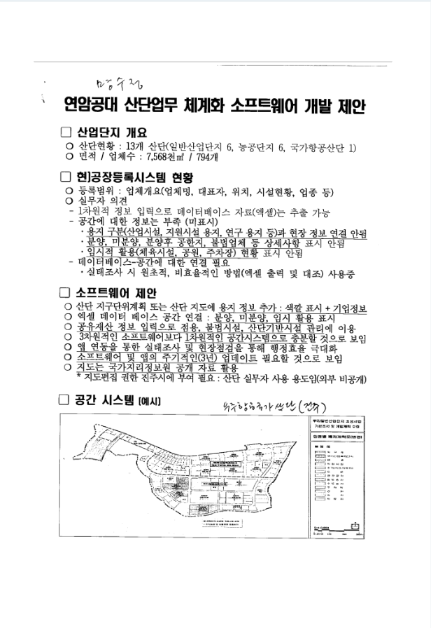

# 산단잇다 — YIT Capstone 2026

> **산업단지 업무 체계화를 위한 공간정보 기반 통합관리 소프트웨어 개발**

연암공과대학교 캡스톤디자인 **7인 팀 프로젝트**입니다.

기업·용지·시설 정보를 실제 지도 위치와 연결하여 한눈에 조회하고 관리할 수 있는 웹 시스템을 개발합니다.



## 프로젝트 배경

현재 산업단지의 기업·용지·시설 정보는 엑셀이나 데이터베이스로 관리되고 있지만, 지도상의 실제 위치와 연결해서 확인하기 어렵습니다. 담당자는 분양 상태나 유휴부지를 확인할 때 여러 자료를 따로 찾고 현장 정보와 직접 대조해야 합니다.

**산단잇다**는 흩어진 정보를 공간정보와 통합하여 담당자의 조회·관리·현장조사 업무를 체계화하는 것을 목표로 합니다.

## 핵심 기능

1. **지도 기반 용지 현황 확인**: 산업단지 지도에서 용지 위치와 분양·입주·유휴 등의 상태를 색상으로 구분합니다.
2. **연결 정보 조회**: 지도에서 용지를 선택하면 입주기업, 업종, 시설 등 관련 정보를 함께 보여줍니다.
3. **통합 검색 및 조건별 현황 조회**: 기업·용지·시설을 검색하고 조건에 맞는 현황을 필터링합니다.
4. **관리자 데이터 관리**: 관리자가 정보를 등록·수정하고 기존 엑셀 데이터를 시스템과 연계할 수 있도록 합니다.
5. **현장 실태조사 및 정보 갱신 지원**: 현장 확인 결과를 반영하고 이후에도 최신 정보를 지속적으로 관리할 수 있도록 합니다.

## 12월 목표 산출물

- 실제 시연이 가능한 지도 기반 웹 시스템
- 기업·용지·시설 정보를 관리하는 관리자 화면
- 공간정보와 기존 업무 데이터를 연계한 통합 데이터베이스
- 사용자 매뉴얼
- 캡스톤디자인 결과보고서

## 우선 진행 사항

기관 첫 미팅에서 아래 내용을 반드시 확인하고 개발 범위를 확정합니다.

- 제공 가능한 지도 데이터의 형식과 범위
- 제공 가능한 기업·용지·시설 엑셀 데이터의 항목과 품질
- 분양·입주·유휴부지 상태의 구분 기준
- 각 정보의 등록·검수·갱신 담당자와 업무 절차
- 외부 공개 가능 정보와 내부 관리자 전용 정보의 범위
- 현장 실태조사 방식과 시스템 사용 환경

데이터 범위와 갱신 기준이 확정되어야 데이터베이스 구조, 지도 표현 방식, 관리자 기능의 개발 범위를 정확히 정할 수 있습니다.

## 개발 흐름

```text
기관 요구사항·데이터 확인
        ↓
데이터 정제 및 통합 DB 설계
        ↓
지도·검색·상세 조회 기능 개발
        ↓
관리자 등록·수정 및 엑셀 연계
        ↓
현장 활용 검증·테스트
        ↓
시연 시스템·매뉴얼·결과보고서 완성
```

## Repositories

| Repository | 역할 | 공개 범위 |
|---|---|---|
| [Frontend](https://github.com/YIT-Capstone-2026/Frontend) | 지도, 검색, 상세 조회, 관리자 화면 | Private |
| [Backend](https://github.com/YIT-Capstone-2026/Backend) | API, 인증, 비즈니스 로직, 데이터 연계 | Private |
| [common](https://github.com/YIT-Capstone-2026/common) | 협업 규칙과 프로젝트 공통 문서 | Public |

> Frontend와 Backend 저장소는 Organization 멤버만 접근할 수 있습니다.

## 협업 방식

팀 협업 규칙은 [common Repository](https://github.com/YIT-Capstone-2026/common)에서 관리합니다.

- Branch Strategy
- Commit Convention
- Pull Request Convention
- Issue Convention

```text
Issue → Branch → Commit → Pull Request → Review → Merge
```

## 제출 전 확인

캡스톤디자인 참여신청서의 총인원은 **7명**으로 수정하고, 누락된 참여 학생 1명의 행을 추가해야 합니다.
